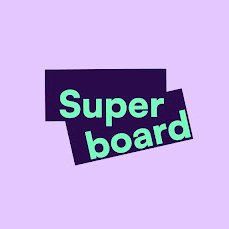

**Superboard**（https://superboard.xyz/） 是一个专注于 Web3 和区块链技术的任务探索平台，旨在通过互动任务和奖励机制，帮助用户深入了解和参与去中心化应用（DApps)、加密货币生态系统以及新兴的区块链技术。

---

### 1. Superboard介绍
Superboard 的核心定位是“Your Web3 Adventure Starts Here”。它是一个链上发现平台，将学习、赚取奖励和探索结合起来，为用户提供一个直观且有趣的方式进入 Web3 世界。网站通过“**任务（Quests）**”的形式，引导用户完成与区块链相关的活动，例如跨链交易、NFT 铸造、去中心化金融（DeFi）操作等，同时提供奖励以激励参与。

Superboard 成立于 2022 年，是一家由小型团队运营的初创公司，专注于金融服务和区块链技术。

---

### 2. 主要功能
Superboard 的设计围绕以下几个核心功能展开：

#### （1）任务系统（Quests）
- **内容**：任务种类多样，涵盖 DeFi（去中心化金融）、NFTs（非同质化代币）、SocialFi（社交金融）等领域。例如，用户可能被要求完成跨链资产转移、参与某个协议的测试，或探索新兴区块链生态。
- **目的**：通过完成任务，用户可以熟悉 Web3 工具和应用，同时获得奖励。

#### （2）多链支持
- Superboard 支持多个区块链网络，例如Ethereum、 Solana、Base 等，并通过跨链桥（如 Axelar 或 Relay）实现资产和任务的链间连接。
- 这种多链兼容性使用户能够探索不同生态系统，而不仅仅局限于单一区块链。

#### （3）奖励机制
- 用户完成任务后可获得加密货币奖励、NFT 或积分（Points），这些奖励通常与合作项目挂钩。
- 平台强调“真实激励”，避免常见的“虚假空投”骗局，确保奖励透明且可信。

#### （4）应用探索（Apps）
- Superboard 每天推荐新的 Web3 应用，帮助用户跟上行业发展的前沿。

#### （5）社区与教育
- 平台不仅是一个任务工具，还通过任务设计“揭开区块链复杂性的面纱”，提升用户对 Web3 的理解。
- 它鼓励用户加入社区，参与讨论，并通过实际操作学习区块链知识。

---

### 3. 特色与优势
Superboard 在众多 Web3 平台中脱颖而出，主要得益于以下特点：
- **用户友好**：任务化设计将复杂的区块链操作简化为可执行的步骤，适合新手和资深用户。
- **多样性**：支持多种任务类型和区块链网络，覆盖面广。
- **安全性与透明度**：奖励系统基于智能合约，公开透明，减少欺诈风险。
- **趣味性**：通过“冒险”和“探索”的概念，将枯燥的操作转化为游戏化的体验。
- **实时更新**：与最新 Web3 项目合作，保持内容新鲜，例如近期推出的“Coinbase 链上收益 NFT 铸造”任务。

---

### 4. 使用场景
Superboard 适用于不同类型的用户：
- **Web3 新手**：想了解区块链但不知从何入手的人，可以通过任务逐步学习。
- **加密爱好者**：希望发现新项目、赚取额外奖励的用户。
- **项目方**：区块链项目可以通过 Superboard 发布任务，吸引用户参与并推广其生态。
- **开发者与玩家**：对新兴技术（如 ZK、Layer 3）或链上游戏感兴趣的人。

---

### 6. 潜在价值与未来发展
- **用户价值**：Superboard 通过奖励和教育降低 Web3 入门的门槛，同时为用户提供赚取加密资产的机会。
- **行业影响**：它推动了 Web3 的普及，帮助项目方触达更多受众。
- **未来展望**：随着区块链技术发展，Superboard 可能会扩展到更多链、集成 AI 或推出更复杂的任务系统。

目前，Superboard 的社交影响力正在增长，其 X 账号（@Superboard_）拥有近 5 万关注者，显示出一定的社区活跃度。

---

### 7. 如何使用
1. 访问 https://superboard.xyz/。
2. 连接加密钱包（如 MetaMask）。
3. 浏览任务列表，选择感兴趣的“Quest”。
4. 按照指引完成任务（可能需要持有特定代币或完成链上操作）。
5. 领取奖励（可能是代币、NFT 或积分）。

---

### 总结
Superboard 是一个将 Web3 学习与奖励结合的创新平台，通过任务化、游戏化的方式，让用户在探索区块链世界的同时获得实际回报。它不仅适合初学者入门，也为资深用户提供了发现新项目和赚取收益的途径。
