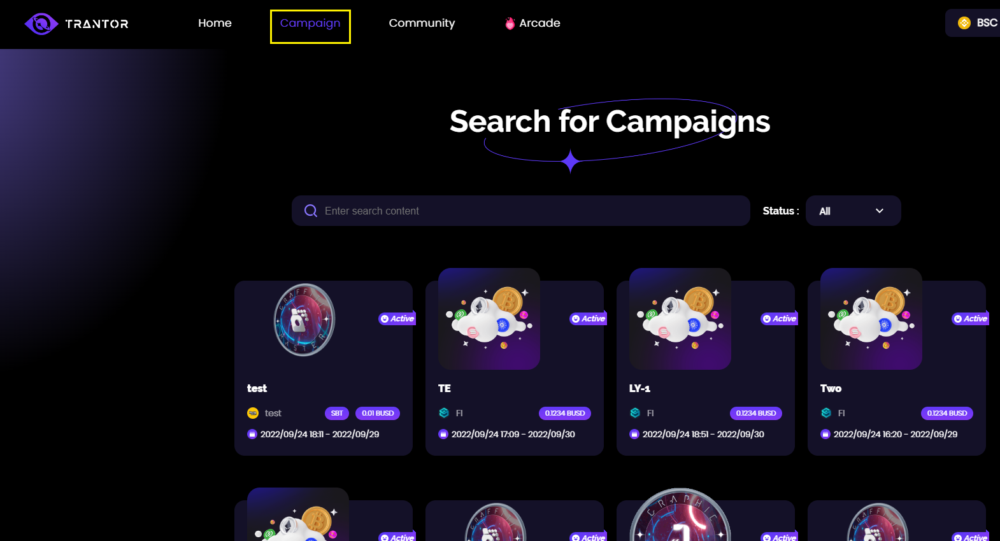
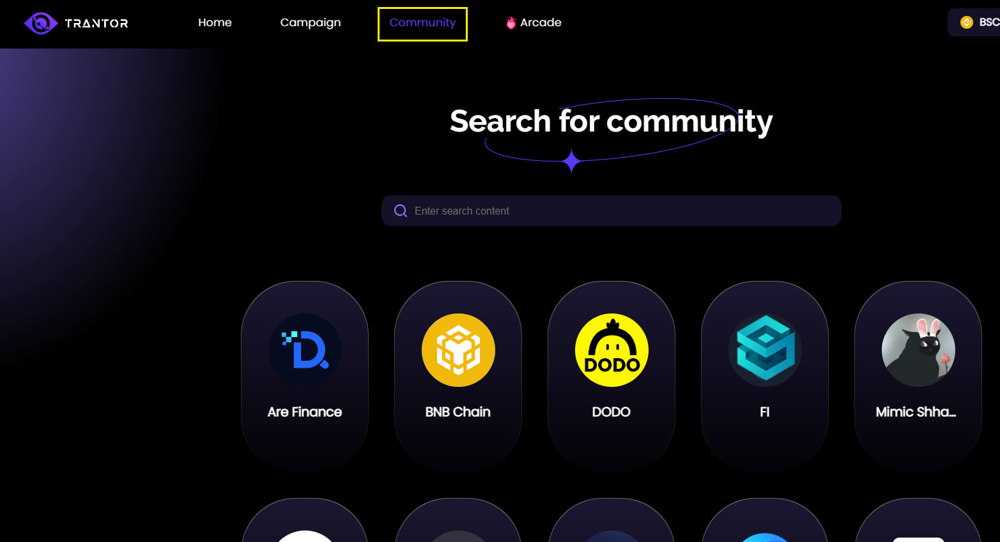
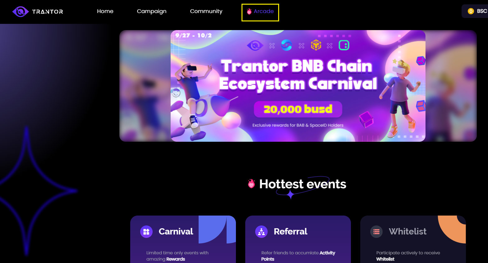

# web3任务平台Trantor

**官方网站：**https://trantor.xyz

**在线帮助文档：**https://docs.trantor.xyz/

**社交平台：**

- Twitter：https://twitter.com/TrantorDAO
- Discord：https://discord.com/invite/ANTMyu8kMw
- Mirror：https://mirror.xyz/0x581b230d20892f474Dae8eBe2D8A6bCC2FC01971

## Trantor平台简介

**平台定位：**Trantor是一个统一的==Web3门户（Web3 portal）==，通过授权的去中心化身份(Decentralized Identities，==DID==)促进社区和品牌之间的互联互通。

**项目方**：通过广告（任务活动）并吸引新用户，建立和发展社区和品牌，用代币奖励忠实用户。项目、社区和dao将能够创建各种任务、挑战和活动。

## Trantor平台用户指南

### 创建帐号

- 访问官方网站，连接Metamask钱包、签名
- 绑定社交平台账号：Twitter，Discord，Telegram

### 完成任务赚取奖励

**Campaign：** At the top left corner, you'll be able to search and explore ongoing and past campaigns under the <Campaign> tab.

**Community：** You'll also be able to search and explore current communities under the <**Community**> tab.

**Arcade：** All exciting **cross-project collaborations and events** will be held in the <**Arcade**> section, where we'll be giving away **huge prize pools** to active users and participants.

**任务类型：**

- Twitter：Follow、Retweet、Like
- NFT Holder
- 加入Discorder
- 加入Telegram Channel
- 定制化的Quest

**奖励类型：**

- SBT：Soul Bound Token
- BUSD or USDT

